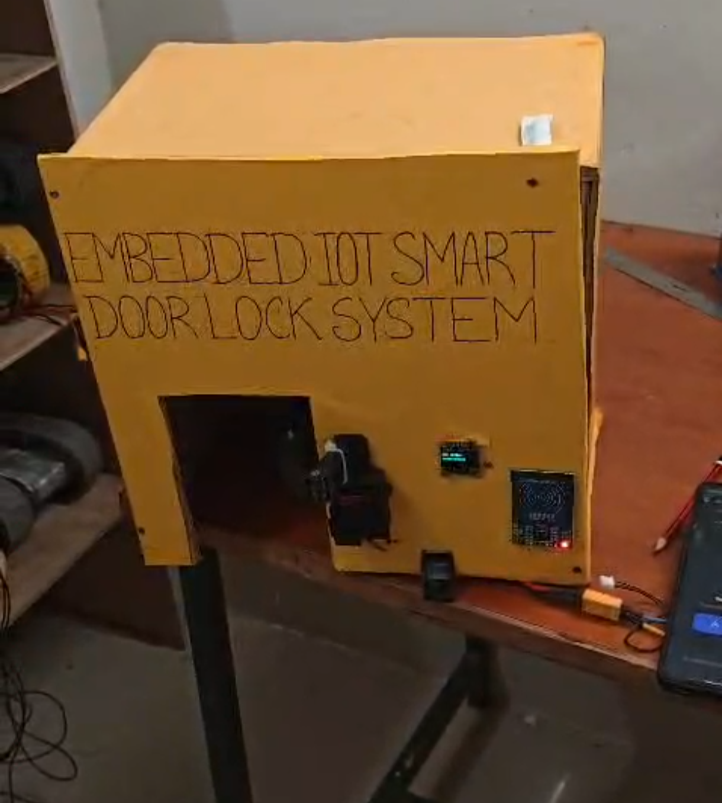

# ESP32 IoT Smart Lock with Multi-Level Authentication

An ESP32-based IoT smart lock system that provides multiple authentication methods sensor RFID, fingerprint recognition, and Blynk-based remote access.

## 📌 Project Overview

The Embedded IoT Smart Lock with Multi-Level Authentication is an ESP32-based access control system designed to provide secure and convenient door locking.

The ESP32 acts as the main controller and integrates an RFID reader, fingerprint sensor, OLED display, servo motors, and Wi-Fi-based Blynk connectivity.

The system supports three access methods:

- RFID card authentication
- Fingerprint authentication
- Remote unlocking through the Blynk mobile application

When authentication is successful, the ESP32 controls the locking and door mechanisms using servo motors. The OLED display provides system and authentication status.

## 📷 Project Prototype

## ✨ Features

- ESP32-based embedded control
- RFID authentication using RC522
- Fingerprint authentication using R307
- Wi-Fi connectivity
- Remote unlocking using Blynk IoT
- OLED status display
- Servo-controlled locking mechanism
- Automatic door opening and closing
- Real-time date and time display
- Multiple authentication methods

## 🧰 Hardware Components

| Component | Purpose |
|-----------|---------|
| ESP32 | Main microcontroller |
| RC522 RFID Reader | RFID authentication |
| R307 Fingerprint Sensor | Biometric authentication |
| 0.96-inch OLED Display | System status and messages |
| Servo Motor | Lock mechanism |
| Servo Motor | Door opening and closing |
| Wi-Fi | IoT connectivity |
| Smartphone | Blynk remote control |

## 💻 Software and Technologies

- Arduino IDE
- Embedded C/C++
- ESP32
- Blynk IoT
- RFID / RC522
- R307 Fingerprint Sensor
- SSD1306 OLED
- SPI
- I2C
- UART
- PWM
- GitHub

## 🔐 Authentication Methods

### 1. RFID Authentication

The RC522 RFID reader reads the UID of an RFID card or tag.

The ESP32 compares the detected UID with the configured authorized UID.

If the UID is valid, the system starts the door unlocking sequence.

If the UID is invalid, access is denied and the door remains locked.

### 2. Fingerprint Authentication

The R307 fingerprint sensor communicates with the ESP32 through UART.

The fingerprint is captured and converted into a template. The sensor then searches its stored fingerprint database.

If a valid fingerprint is detected, the door unlocking sequence is activated.

### 3. Blynk Remote Access

The ESP32 connects to the Blynk IoT platform through Wi-Fi.

A Blynk virtual button can be used to trigger remote unlocking.

The firmware uses virtual pins for remote control and enrollment-mode triggers.

## ⚙️ System Working

The basic working sequence is:

    Authentication
          ↓
    Authentication Valid?
       ↓           ↓
      YES          NO
       ↓           ↓
    Unlock       Access Denied
       ↓
    Open Door
       ↓
    Wait
       ↓
    Close Door
       ↓
     Lock Door

The system continuously monitors the available authentication methods.

After successful authentication, the lock servo moves to the unlocked position and the door servo opens the door.

After the configured time, the door closes and the locking mechanism returns to the secured position.

## 🔌 Pin Configuration

### RFID – RC522

    SS  → GPIO 5
    RST → GPIO 4

The RFID reader communicates with the ESP32 using SPI.

### Fingerprint Sensor – R307

    RX → GPIO 16
    TX → GPIO 17

The fingerprint sensor communicates with the ESP32 using UART at 57600 baud.

### Servo Motors

    Lock Servo → GPIO 25
    Door Servo → GPIO 26

### OLED Display

The SSD1306 OLED uses the I2C interface.

    SDA → GPIO 21
    SCL → GPIO 22
    Address → 0x3C

## 🔄 Door Control Sequence

After successful authentication:

    1. Unlock the lock
    2. Open the door
    3. Keep the door open for the configured period
    4. Close the door
    5. Lock the door

The current firmware uses a 5-second door-open duration.

## 📂 Repository Structure

    esp32-iot-smart-lock/
    │
    ├── README.md
    │
    └── src/
        └── smart_lock.ino

## 📄 Source Code

The main ESP32 firmware is available in:

    src/smart_lock.ino

The code uploaded to this public repository has been cleaned to prevent sensitive credentials from being exposed.

## 🔒 Security Note

Sensitive information should not be published in a public GitHub repository.

The following values have been replaced with placeholders in the public version:

- Wi-Fi SSID
- Wi-Fi password
- Blynk authentication token
- Authorized RFID UID

For local hardware testing, these values must be configured privately.

Example:

    #define BLYNK_TEMPLATE_ID "YOUR_BLYNK_TEMPLATE_ID"
    #define BLYNK_AUTH_TOKEN "YOUR_BLYNK_AUTH_TOKEN"

    char ssid[] = "YOUR_WIFI_SSID";
    char pass[] = "YOUR_WIFI_PASSWORD";

    String AUTHORIZED_UID = "YOUR_AUTHORIZED_UID";

## 👥 Project

This was developed as a group academic project titled:

**"Embedded IoT Smart Lock with Multi-Level Authentication"**

The project combines embedded systems, IoT communication, RFID authentication, biometric authentication, OLED display, and servo-based door control.

## 👤 My Contribution

As a member of the project team, I contributed to the development of the ESP32 IoT Smart Lock system.

My contributions included:

- ESP32 programming and embedded system development
- RFID authentication implementation
- Fingerprint authentication integration
- Wi-Fi and Blynk connectivity
- Project documentation and technical report preparation
  
## 🚀 Future Improvements

Possible future improvements include:

- Dynamic RFID card enrollment
- Complete fingerprint enrollment through the Blynk interface
- Improved access logging
- Mobile notifications
- Improved security and credential management
- Better power management
- Improved mechanical locking mechanism
- Additional authentication and monitoring features

## 🎯 Applications

The system can be adapted for:

- Smart homes
- Offices
- Laboratories
- Restricted-access rooms
- Small-scale access-control systems
- IoT-based security applications

## 📚 Documentation

The project documentation covers the system architecture, hardware components, communication interfaces, authentication methods, firmware implementation, and door-control mechanism.

---

**Technologies:** ESP32 • RFID • Fingerprint • Blynk IoT • OLED • Servo • Arduino IDE
